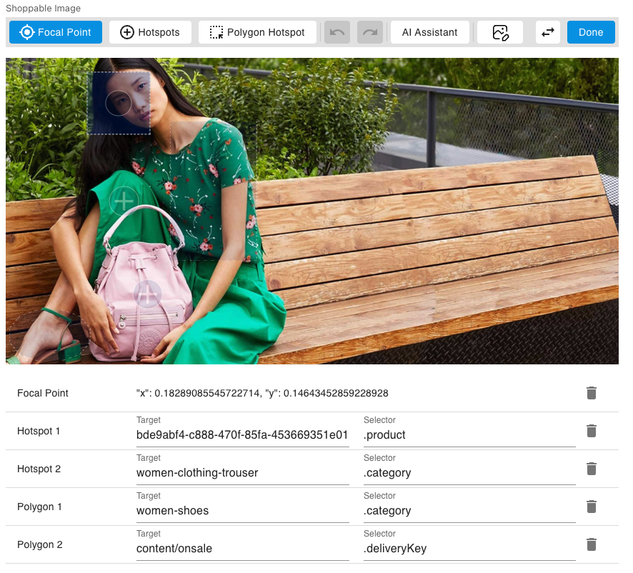

[](https://amplience.com/dynamic-content)



# Dynamic Content Shoppable Image Extension

This extension allows users to define Focal Points and interactable Hotspots over an image, in format similar to what Content Hub provides, but with the data being stored on a content item.

If you want to get started after cloning this repo, remember to sync packages with `yarn install`.

## Partial for Shoppabble image Field and Configuration

The shoppable image extension has a rather complicated structure for the field it writes, so it's recommended that you put the schema in a partial. You can find the full partial definition in `shoppable-image-partial.json` in the base of this repository.

To use the schema when imported as a partial, use this snippet:

```json
{
    "shoppableImage": {
        "title": "Shoppable Image",
        "description": "An image enriched with a focal point and hotspots.",
        "allOf": [
            { "$ref": "https://amplience.com/shoppable-image-partial#/definitions/shoppableImage" }
        ]
    }
}
```

## Visualization

The webapp for the extension can also double as a standalone visualization for the shoppable image field. It will run in visualization mode if you provide `?vse={{vse.domain}}` as a query sting parameter, and will read back the field from the `shoppableImage` property of your content item. If you want to provide a different top level property, simply provide it in the query string like `fieldName=exampleImage`.

The visualization uses the `dc-visualization-sdk` to update its preview as the field is being edited, so you'll be able to try hotspot interaction over your image as you add and move hotspots.

To add the visualization to your content type, just switch to the `Visualizations` tab, and add a visualization with the extension as the url, and the query string `?vse={{vse.domain}}`.

## Development server

Run `HTTPS=true yarn run start` for a dev server. Navigate to `https://localhost:3000/`. The app will automatically reload if you change any of the source files.

If you want to test on DC, you'll need to link an extension to that same localhost url. Keep in mind that you might run into a browser security issue when using SSL, so if you're having any issues visit the extension directly and accept any ssl warnings.

## Build

Run `yarn build`. The built extension will then be present in the `build/` directory, and you can upload it to any webserver.