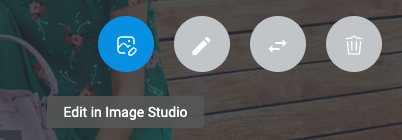

# Dynamic Content Shoppable Image Extension

This extension allows users to define Focal Points and interactable Hotspots over an image, in a format similar to what Content Hub provides, but with the data being stored on a content item.

If you want to get started after cloning this repo, remember to sync packages with `yarn install`.

This project requires Node 16.x to build.

## Image Studio

The extension has been fully integrated with Image Studio. This allows the user to launch Image Studio and utilise its powerful tools to modify the base image.



You can find more information about using Image Studio in the [Amplience Studios docs](https://amplience.com/developers/docs/amplience-studios/)


## How to install

### Partial for Shoppabble Image Field and Configuration

The shoppable image extension has a rather complicated structure for the field it writes, so it's recommended that you put the schema in a partial. You can find the full partial definition in `shoppable-image-partial.json` in the base of this repository.

- Log in, go to Development -> Content type schemas -> Create schema -> Code from scratch
- Enter "https://amplience.com/shoppable-image-partial" as your ID (feel free to use another ID)
- Validation level: "partial"
- Click "create schema"
- Once in the editor set the value of `"definitions"` to be the contents of `shoppable-image-partial.json`

  ```
  "definitions": <contents of shoppable-image-partial.json>
  ```

- save it.

### Register Extension

This extension needs to be [registered](https://amplience.com/docs/development/registeringextensions.html) against a Hub with in the Dynamic Content application (Development -> Extensions-> Register extension), for it to load within that Hub.

#### Setup


- Category: Content Field
- Label: Shoppable Image _(this will appear as the tab title in the Dashboard)_
- Name: shoppable-image _(needs to be unique with the Hub)_
- URL: [https://shoppable-image.extensions.content.amplience.net](https://shoppable-image.extensions.content.amplience.net)
- Description: Shoppable Image Extension _(can be left blank, if you wish)_

Note:
You can use our deployed version of this extension (builds from the "production" branch) -

[https://shoppable-image.extensions.content.amplience.net](https://shoppable-image.extensions.content.amplience.net)

_As this is an open source project you're welcome to host your own "fork" of this project. You can use any standard static hosting service (Netlify, Amplify, Vercel, etc.) if you wish._

#### Permissions


API Permissions:

- Read access
- Modify access

Sandbox permissions:

- Allow same origin
- Allow pop-ups
- Allow pop-ups to escape sandbox

#### Snippets

- Label: shoppable-image
- Paste this snippet into the editor:
```
{
    "title": "Shoppable Image",
    "description": "An image enriched with a focal point and hotspots.",
    "allOf": [
      {
        "$ref": "https://amplience.com/shoppable-image-partial#/definitions/shoppableImage"
      }
    ]
}
```
- Hit save.

>NB: if you have given your partial a unique ID, replace the above `$ref` URI to be "<YOUR_PARTIAL_SCHEMA_ID>#/definitions/shoppableImage"

### Assign the extension to schema

- Go to Development -> Content type schema -> Create schema -> Code from scratch
- Enter "https://amplience.com/shoppable-image-content-type" as your ID (feel free to use another ID)
- Validation level "content type"
-  Assign the "Shoppable Image" extension to the `"properties"` field. (listed within "add extension" in the top right hand corner of your editor)
- A default field name will be provided. Rename this to "shoppableImage".
- Save it. Go back to development and create a content type for your new schema.
- Go to Production and make as many content items as your heart desires.

## Output Data Format & Usage

The shoppable image extension creates a simple format that you can ingest in your site to use or represent hotspots and the point of interest however you want.

For information on the format structure, and how you might use it in your own renderer, see [this documentation.](docs/FORMAT-USAGE.md)

## Visualization

The webapp for the extension can also double as a standalone visualization for the shoppable image field. It will run in visualization mode if you provide `?vse={{vse.domain}}` as a query string parameter, and will read back the field from the `shoppableImage` property of your content item. If you want to provide a different top level property, simply provide it in the query string like `fieldName=exampleImage`.

The visualization uses the `dc-visualization-sdk` to update its preview as the field is being edited, so you'll be able to try hotspot interaction over your image as you add and move hotspots.

To add the visualization to your content type, just switch to the `Visualizations` tab, and add a visualization with the extension as the url, and the query string `?vse={{vse.domain}}`.

## Development server

Run `HTTPS=true yarn run start` for a dev server. Navigate to `https://localhost:3000/`. The app will automatically reload if you change any of the source files.

If you want to test on DC, you'll need to link an extension to that same localhost url. Keep in mind that you might run into a browser security issue when using SSL, so if you're having any issues visit the extension directly and accept any ssl warnings.

## Build

Run `yarn build`. The built extension will then be present in the `build/` directory, and you can upload it to any webserver.
