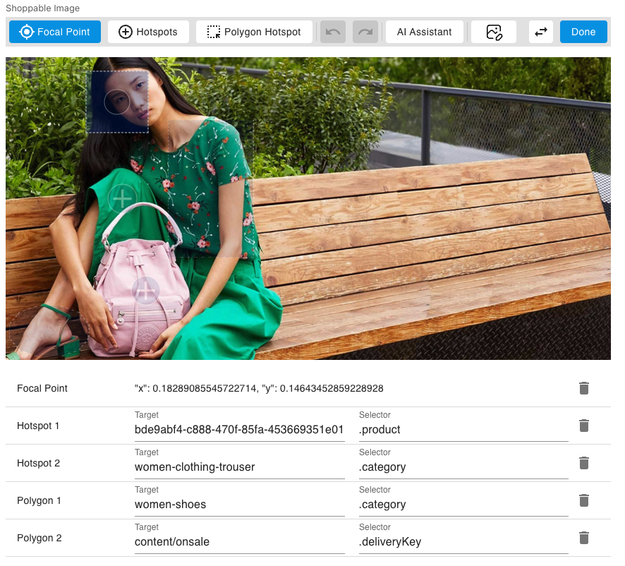

# Format & Usage information

This document will explain what each of the fields in the partial maps to, and how to use them in your own applications.

## Example



In the example image above, a few regions of the image have been highlighted with polygon hotspots, there is a Point of Interest centered on the camera, and there is a hotspot placed on top of a watch.

Here is the JSON for this Shoppable Image:

```json
{
  "shoppableImage": {
    "image": {
      "_meta": {
        "schema": "http://bigcontent.io/cms/schema/v1/core#/definitions/image-link"
      },
      "id": "b82e697a-0c8d-4270-9241-58ce6b53948c",
      "name": "hipster-bag",
      "endpoint": "csdemo",
      "defaultHost": "cdn.media.amplience.net"
    },
    "poi": {
      "x": 0.38377001455604076,
      "y": 0.7459606986899564,
      "w": 0.09999999999999999,
      "h": 0.15
    },
    "hotspots":[
      {
        "id": "4b70802c-0499-4c6f-aa27-1e4ff0b125cb",
        "target": "Watch",
        "selector": ".watch",
        "points": {
          "x": 0.5647743813682679,
          "y": 0.8384279475982532
        }
      }
    ],
    "polygons": [
      {
        "id": "744a00b9-0b21-47b5-800e-789911e0ad9a",
        "target": "Shirt",
        "selector": ".Shirt",
        "points": [
          {
            "x": 0.11062590975254731,
            "y": 0.4912663755458515
          },
          {
            "x": 0.33624454148471616,
            "y": 0.4912663755458515
          },
          {
            "x": 0.33624454148471616,
            "y": 0.8973799126637555
          },
          {
            "x": 0.11062590975254731,
            "y": 0.8973799126637555
          }
        ]
      },
      {
        "id": "6264b28f-0db9-4caf-b4d5-900bfb140d1a",
        "target": "Fabric",
        "selector": ".fabric",
        "points": [
          {
            "x": 0.4735225618631732,
            "y": 0.36899563318777295
          },
          {
            "x": 0.5352110625909757,
            "y": 0.36899563318777295
          },
          {
            "x": 0.5921542940320236,
            "y": 0.4127074235807857
          },
          {
            "x": 0.6229985443959243,
            "y": 0.4934061135371177
          },
          {
            "x": 0.6229985443959243,
            "y": 0.5808296943231442
          },
          {
            "x": 0.5921542940320236,
            "y": 0.6615283842794764
          },
          {
            "x": 0.5352110625909757,
            "y": 0.7052401746724891
          },
          {
            "x": 0.4735225618631732,
            "y": 0.7052401746724891
          },
          {
            "x": 0.41657933042212547,
            "y": 0.6615283842794764
          },
          {
            "x": 0.38573508005822416,
            "y": 0.5808296943231442
          },
          {
            "x": 0.38573508005822416,
            "y": 0.4934061135371177
          },
          {
            "x": 0.41657933042212547,
            "y": 0.4127074235807857
          }
        ]
      },
      {
        "id": "5678248d-6ad5-40c7-bb20-a68e9f3f1312",
        "target": "Bag",
        "selector": ".bag",
        "points": [
          {
            "x": 0.6506550218340611,
            "y": 0.10043668122270744
          },
          {
            "x": 0.9068413391557496,
            "y": 0.10043668122270744
          },
          {
            "x": 0.9068413391557496,
            "y": 0.4781659388646288
          },
          {
            "x": 0.6506550218340611,
            "y": 0.4781659388646288
          }
        ]
      }
    ]
  }
}
```

The `image` field is a normal amplience media link. You can use the provided information to request the image. Here is an example handlebars template for generating an `` `src` attribute from an `image` object:

```hbs
https://{{image.defaultHost}}/i/{{image.endpoint}}/{{image.name}}
```

The `poi` field represents a point of interest - an anchor point for the image to be centered around when cropping. The point of interest is technically a rectangle; it contains `x` and `y` positions, as well as width `w` and height `h`. The point is considered in the center of the rectangle.

The `hotspots` field is an array of hotspot objects
- `id`: GUID for the hotspot. Can be used to uniquely identify the hotspot.
- `target`: Target string. It's up to the user what this means.
- `selector`: Selector string. It's up to the user what this means.
- `points`: An object containing a single point for the hotspot. `x` and `y` contain the x and y postions, respectively.

The `polygons` field is an array of polygon objects
- `id`: GUID for the polygon. Can be used to uniquely identify the polygon.
- `target`: Target string. It's up to the user what this means.
- `selector`: Selector string. It's up to the user what this means.
- `points`: An array of points that construct the polygon. The final point is connected to the first point to form a closed loop.

## Interactive Hotspots over an Image

To place interactive elements over your image, you need both a container for them, and some code to calculate their placement relative to the scaled image size. The visualization does this by creating a container with the image size which floats on top of the image itself using `position: absolute;`, and hotspots/polygons which are placed by using css transforms with translations calculated by multiplying the normalized positions with the image size.

Hotspots are easy enough to place by creating a div and styling it yourself, but polygons prove a little more challenging as they can technically create any shape out of their points. The best way to deal with this is to render your polygon within an SVG, and then place that in your container.

You can generate an SVG Path's `d` attribute using the points of the polygon, which will let you draw the path within an SVG with any styling and interaction of your choice. See [polygon-helper.tsx](src/preview/polygon/polygon-helper.tsx) for an example method that does this (`pointsToSVGPath`).

## Point of Interest

As the crop rectangle for the image changes dynamically, the visualization requests the full image and then applies the crop using css and javascript. You can do this by making the image a background and then using background position to move the image to follow the point of interest, or you can put the image in an outer container with `overflow: hidden` and your crop size, and use a css transformation to move the image. It's worth noting here that your interactive hotspots rely on the uncropped size of the image, so if hotspots are used, they should also be transformed in the same manner as the image.

To crop with point of interest and a target aspect, you want to first determine which axis is uncropped. If the w/h ratio of the image is greater than the w/h ratio of the container, then the y-axis will be uncropped, as the wider image will overflow outside of your container in the x-axis. If it is less, the x-axis will be uncropped. You only need to move the image in the axis where it is cropped, so this simplifies calculation a bit.

Let's say that the y-axis is uncropped, that `imageWidth` and `imageHeight` contain the size of the image, and that `targetWidth` contains the width of the cropping container. You can calculate a crop that avoids moving outside the image as follows:

```typescript
// The point of interest needs to be converted back from normalized rectangle
// into a centerpoint with pixel coords.
const poiX = (field.poi.x + field.poi.w / 2 - 0.5) * imageWidth;

// maxDist is the number of pixels of the image that overflow in a single direction.
// This will bound how much the image can be moved in that axis.
const maxDist = (imageWidth - targetWidth) / 2;

offsetTransform = `translate(${Math.min(maxDist, Math.max(-poiX, -maxDist))}px, 0)`;
```

When uncropped on the y-axis, the css for the contained image is `height: 100%; maxWidth: none;`, and it's centered using flex. If uncropped on the other axis, simply swap all X for Y and width for height in the above examples. If using an interactive canvas on top, set its size to that of the image (scaled by its constrained axis) and also have it placed in the middle to float over it.

If you wish to crop the image statically, you can pass the point of interest directly to DI and have it crop around the point of interest for you. Example parameters:

`poi=0.2056,0.5014,0.1124,0.15&scaleFit=poi`

You can add these to any crop that works with Point of Interest, such as an aspect crop. This one sets a width of 141px, and the height is implicitly 141 as well due to the aspect:

`sm=aspect&aspect=1:1&w=141`

If you wish to use both point of interest and hotspots at the same time, then you'll still need to know the original size of the image before cropping, as all coordinates are normalized using that size. This might mean applying the crop rectangle to the full image yourself, or requesting the image metadata separately to get its original size.